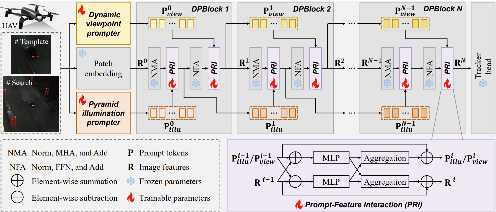

# DPTracker

[](https://www.python.org/)
[](https://pytorch.org/)
[](https://developer.nvidia.com/cuda-toolkit)

A simple and effective tracking framework for nighttime UAV Tracking.

<p align="center">
  
</p>

## 📣 News
- **[2026.02]** Model checkpoints and raw tracking results coming soon!
- **[2026.02]** Our paper has been accepted by ICRA 2026! 🎉

## 📁 Download
- **Models Checkpoints**: [Baidu Netdisk](LINK_TO_MODEL) (Code: XXXX)
- **Tracking Results**: [Baidu Netdisk](LINK_TO_RESULTS) (Code: XXXX)

## 🖥️ Environment
This repo is using Pytorch 2.1.2 with CUDA 11.8.

## 🛠️ Setup
Create the default local file with paths:
```bash
python tracking/create_default_local_file.py \
    --workspace_dir ./ \
    --data_dir ./data \
    --save_dir ./output
```

## 📈 Train
### Preparation
Download the training data, including GOT-10K, LASOT, COCO, and TrackingNet, ExDark, Shift, and BDD100K.

### Run
```
conda activate your_env
bash train.sh
```

## 📊 Test
### Preparation 
Download the test data, including NAT2021, UAVDark135, DarkTrack2021.

### Run
```
conda activate your_env
bash test.sh
```
